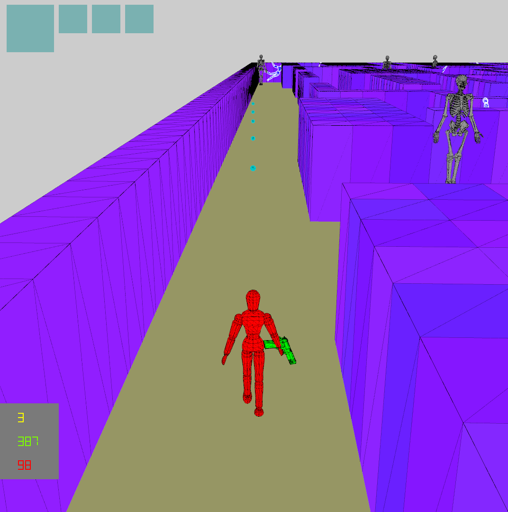

# Graphics Assn #3

##### <span style="float:right">20160785 양준하, 20160463 성해빈 </span>

## Introduction

이번 과제는 지난 Assn2을 바탕으로 하여 둠 게임의 3D 버전을 드디어 만들게 된다. 3D viewing, wireframe rendering, animation 등 여러 기능을 구현하였다.

## Background

### 3D Viewing

일반적인 3D 그래픽의 좌표계 transform 과정은 다음과 같다.

Model coord에서 world coord로 가는 과정은 Hiearchy model의 구현이 필요하다. 그 이후 canonical view volume으로 가기 위해서는 view transform과 projection transform이 필요하다. 
View transform은 카메라와 쳐다보는 위치, 그리고 upvector을 지정해줌으로써 specification이 된다. 이는 카메라의 위치나 각도 등에 대응되는 정보이므로 extrinsic parameter라고도 한다. 그 다음에 projection transform은 화면에 담을 view volume frustum의 폭, near, far 등의 정보로 specification 되고 이는 카메라 자체의 스펙에 대응되므로 intrinsic parameter라고 한다.
### 3D Mesh
3D Mesh는 다수의 버텍스와 그 버텍스들의 인덱스로 face를 구성하는 방식이 일단 기본이고, 그 위에 추가적으로 버텍스별로 텍스쳐좌표나 normal vector등을 지정해줄 수도 있다. 이런 3d Mesh 정보를 담는 대표적인 파일 포맷으로 obj가 있고 이번 프로젝트에서도 그를 사용할 것이다.
## Game
게임플레이 자체는 Assn2와 거의 동일하지만 조작법 상으로 몇가지 차이가 생겼고 아이템 1개의 효과가 달라졌다.
### Two Enemies
적은 두 종류가 있으며 하나는 플레이어와 똑같은 모델(dummy_obj & dummy_obj_red)을 쓰며 다른 하나는 해골 모델(Skeleton) 을 사용하는데 dummy들은 실제로 계층구조를 가지며 부드러운 애니메이션이 구현되어있다. 해골은 obj 자체가 관절단위로 mesh가 분리가 되어있지 않아 애니메이션을 넣지 않았다. 두 종류의 적은 게임 로직상으로는 정확히 똑같은 동작을 한다.
#### 적1

#### 적2

### Player control
플레이어도 dummy_obj를 모델로 하며 계층구조로 애니메이션이 구현되어있다.
마우스 좌클릭을 하면 현재 보고 있는 방향으로 총알을 발사하며 이 때 총을 들어올리는 애니메이션을 볼 수 있다.
평상시에는 계속 걸으면서 팔다리를 왔다갔다 한다.

v키를 누르면 1인칭과 3인칭을 전환할 수 있으며 이 때에도 조작법은 거의 동일하다. 하지만 3인칭에서는 마우스를 활용하여 시점을 미묘하게 조정할 수 있는데 이에 대한 설명은 아래의 3D Viewing을 참조하면 된다.

### Item : camera
아이템은 지난 Assn과 동일하지만 카메라 아이템의 효과가 바뀌었다. 원래는 먹으면 좀 더 위에서 게임을 내려다 볼 수 있었지만 Assn3은 3d view이기 때문에 의미가 없어서 다른 효과로 바뀌었다. <span style="color:red">**추가기능 : 카메라 아이템을 사용하면 벽들이 반투명 해져서 적들을 쉽게 포착할 수 있다.**</span> 그 외에 언급할 사항으로는 아이템 사용키가 q에서 스페이스바로 바뀌었다는 점이 있다.

## Implementation

전반적인 구조는 Assn2과 동일하다. 매트릭스 연산은 모두 glm으로 수행하였다.

### Develop Environment

개발환경은 Visual Studio 2017 C++, 주어진 freeglut와 glew, glm 0.9.9.2 , winsdk 10.0.17134, opengl 4.6 이다. 

빌드는 Release로 해야하는데, STL의 사용이 많아 debug로 빌드하면 각종 Assertion들이 난무해서 게임속도가 심각하게 느려져서 정상적인 플레이가 불가능 할 수도 있다.

### 3D Viewing

일단 내부적으로 Assn3의 게임로직은 여전히 2D로 되어있으며, XY좌표에 위치한다.

다음 코드는 매 프레임마다 호출되는 CGraphics::M_CallbackDisplay()의 일부이다. M_RenderGame()은 실제 world에 존재하는 오브젝트를 그리는 것으로 view transform과 projection transform을 모두 거쳐야하므로 호출하기 전에 V_CTM (current transform matrix)에 미리 다 적용을 해놓고 호출한다
M_RenderUI는 world내 오브젝트가 아니라 화면에 바로 보여야할 컴포넌트이기 때문에 화면좌표계에서 canonical view volume 좌표계로 가는 다른 transform을 적용시키고 호출한다.
CGraphics는 멤버변수 V_Camera_Pos와 V_Camera_Look를 갖고 있는데, 이 둘이 view transform을 할 때 사용된다.
둘의 조작은 M_MoveCamera()에서 일어난다.
```c++
V_CTM_Temp = glm::mat4(1.0);
M_MoveCamera();

glClear(GL_COLOR_BUFFER_BIT | GL_DEPTH_BUFFER_BIT);
V_SM->M_UseProgram("prg1");

V_CTM_Project = glm::mat4(1.0f);
V_CTM_Project = glm::translate(V_CTM_Project, glm::vec3(-1.0, -1.0, 0.0));
V_CTM_Project = glm::scale(V_CTM_Project, glm::vec3(2.0 / V_Screen_Size[0], 2.0 / V_Screen_Size[1], 1));
V_CTM_View = glm::mat4(1.0f);
M_RenderUI();

glm::vec3 v(0.0f);
glm::vec3 up(0, 0, 1);

V_CTM_Project = glm::perspective(glm::radians(45.0f), 1.0f, 0.1f, 1000.0f);
V_CTM_View = glm::lookAt(V_Camera_Pos, V_Camera_Look, up);

M_RenderGame();
glutSwapBuffers();
```

#### M_MoveCamera()

다음은 카메라를 조작하는 코드다.

```c++
double static olda = 0.0;
V_Camera_Look_Angle = V_PEngine->V_Player->M_GetLook().convert_gl();
olda = olda * 0.9 + V_Camera_Look_Angle[0]*0.1;

if (V_ViewMode)
{
    auto ui = CUserInput::getInstance();
    double d = 1-ui->M_MouseGet_Normalized()[1];
    d *= 2;
    auto p = V_PEngine->V_Player->M_GetPosition();
    V_Camera_Pos[0] = p[0] - cos(olda) * (15 + 15*d);
    V_Camera_Pos[1] = p[1] - sin(olda) * (15 + 15*d);
    V_Camera_Pos[2] = 20;

    V_Camera_Look = V_Camera_Pos;
    V_Camera_Look[0] += (20 + 15*d)*cos(V_Camera_Look_Angle[0]);
    V_Camera_Look[1] += (20 + 15 * d)*sin(V_Camera_Look_Angle[0]);
    V_Camera_Look[2] = 5;
}
else
{
    auto p = V_PEngine->V_Player->M_GetPosition();
    V_Camera_Pos[0] = p[0] + 0.8*cos(V_Camera_Look_Angle[0]);
    V_Camera_Pos[1] = p[1] + 0.8*sin(V_Camera_Look_Angle[0]);
    V_Camera_Pos[2] = 3;

    V_Camera_Look = V_Camera_Pos;
    V_Camera_Look[0] += 5 * cos(V_Camera_Look_Angle[0]);
    V_Camera_Look[1] += 5 * sin(V_Camera_Look_Angle[0]);
    V_Camera_Look[2] += 2 * sin(V_Camera_Look_Angle[1]);
}
```
olda는 부드러운 각도 전환을 위해 사용한 버퍼이다.
V_ViewMode가 true일때는 3인칭, false일때는 1인칭이라서 일단 분기가 된다.
1인칭을 먼저 설명하자면 일단 V_Camera_Pos는 우리의 사람모델 살짝 앞에 위치시켰는데, 그래야지 모델 내부에 다 가리는 일이 생기지 않기 때문이다. V_Camera_Look_Angle는 내부적으로 관리되고 있는 사용자가 보고 있는 각도인데, 일단 V_Camera_Look_Angle[0], 즉 horizontal 성분만 변하게 되어있다. 보고있는 각도에 따라 V_Camera_Look은 살짝 더 멀리 위치시키면 끝이다.

3인칭일때는 좀 복잡한데, 마우스에 따라 간단한 조작이 가능하기 때문이다.
<span style="color:red">**추가기능 : 마우스의 y축 성분만 읽어 마우스를 위로 올리면 좀 더 높이서 멀리 볼 수 있도록 하였다.**</span> y축 위치가 d인데, d가 높을 수록 카메라의 위치를 좀 더 당기고, look도 멀리 보낸다.
어쨌든 카메라가 플레이어의 뒤의 약간 위에 있고, look은 보는 방향으로 멀리 있으므로 플레이어의 뒤통수를 보면서 3인칭을 유지할 수 있다.

#### Billboard
<span style="color:red">**추가기능 : 빌보드는 카메라를 항상 쳐다보는 오브젝트를 말한다. 이는 구현하기 쉬운데, view transform의 translate부분을 제외한 rotate매트릭스만 따와 그 역행렬을 맨 처음에 적용하면 그 오브젝트는 3D 상에 올바른 위치에 있지만 항상 나를 바라보게 된다. 아이템들은 딱히 mesh가 아니라 그냥 2d image형태이기 때문에 빌보드를 적용하였다.**</span>

```c++
glm::mat4 CGraphics::M_GetBillboardMat(void)
{
	auto view = V_CTM_View;
	view = glm::transpose(view);
	for (int i = 0; i < 3; i++)
		view[i][3] = 0;
	view = glm::transpose(view); //inverse
	return glm::transpose(view);
}
```
### Rendering
렌더링 파이프라인은 Assn2와 같지만 wireframe 렌더링을 위해 살짝 바뀐 부분이 있다.
#### CDrawing
CDrawing은 새로 추가된 함수로, 계층 모델 내부에서 transform을 적용받으면서 수행될 렌더링의 기초단위에 대한 추상화다.
특정 폴리곤을 실제로 그리는 일을 하며, 계층 모델의 node들은 각각 CDrawing의 인스턴스를 갖고있다
#### void CDrawing::M_Draw(const glm::mat4& mat, T4Double color)
실제로 drawing을 수행하는 함수로 wireframe에 대한 처리도 일어난다.
```c++
void CDrawing::M_Draw(const glm::mat4& mat, T4Double color)
{
	if (V_Array.aindex == -1) return; //dummy draw

	glBindVertexArray(V_Array.aindex);
	GLuint p = glGetUniformLocation(V_PSM->M_GetProgram() , "trans");
	GLuint q = glGetUniformLocation(V_PSM->M_GetProgram(), "vicolor");
	glUniformMatrix4fv(p, 1, GL_FALSE, &mat[0][0]);
	float col[4];
	for (int i = 0; i< 4; i++) col[i] = V_Color[i] * color[i];
	glUniform4fv(q, 1, col);


	if (V_DrawMode == 2) glDrawArrays(GL_TRIANGLE_STRIP, 0, V_Array.num); 
	else if (V_DrawMode == 1) glDrawArrays(GL_LINE_STRIP, 0, V_Array.num); //wireframe
	else if (V_DrawMode == 3) // wireframe + color
	{
		glDrawArrays(GL_TRIANGLE_STRIP, 0, V_Array.num);
		for (int i = 0; i < 4; i++) col[i] = V_LineColor[i];// *color[i];
		glUniform4fv(q, 1, col);

		glPolygonMode(GL_FRONT_AND_BACK, GL_LINE); // no fill
		glDrawArrays(GL_TRIANGLE_STRIP, 0, V_Array.num);
		glPolygonMode(GL_FRONT_AND_BACK, GL_FILL); // back to default
	}
	else if (V_DrawMode == 0)glDrawArrays(GL_POINTS, 0, V_Array.num); 
	else if (V_DrawMode == 4)glDrawArrays(GL_TRIANGLES, 0, V_Array.num);
	else if (V_DrawMode == 5)
	{
		glDrawArrays(GL_TRIANGLES, 0, V_Array.num);
		for (int i = 0; i < 4; i++) col[i] = V_LineColor[i];// *color[i];
		glUniform4fv(q, 1, col);

		glPolygonMode(GL_FRONT_AND_BACK, GL_LINE); // no fill
		glDrawArrays(GL_TRIANGLES, 0, V_Array.num);
		glPolygonMode(GL_FRONT_AND_BACK, GL_FILL); // back to default
	}
	else if (V_DrawMode == 6)
	{
		glDrawArrays(GL_LINES, 0, V_Array.num);
	}
}
```
함수의 윗부분은 uniform에 행렬을 넣어주는 등의 절차로 assn2와 동일하다.
하지만 밑에 V_DrawMode에 따라 분기가 많은데, V_DrawMode는 해당 CDrawing 인스턴스를 어떤 방법으로 그릴지에 대한 옵션이다. 미리 정의되어 있는게 많은데, strip을 쓸지 triangles를 쓸지 lines를 쓸지 등 실제 glDrawArrays의 옵션과 일대일 대응되는 것들도 있지만 3번이나 5번 옵션같은 경우에는 좀 다른다. 3번과 5번의 차이는 strip이냐 trinagles냐 밖에 없고, 실제 우리가쓰는 obj는 strip으로 전환하지 않았기에 5번을 기준으로 설명하겠다.

일단 GL_TRIANGLES를 이용하여 면을 그린다. 그런다음 glPolygonMode를 이용하여 선만 그리도록 하고, 다시 glDrawArrays를 하여 똑같은 버텍스를 선만 그리도록 한다. (위에 있는 col은 선과 면의 색이 다르기 때문에 다시 uniform에 넣어주는 절차이다.)
수업시간에 교수님의 설명에 따라 hidden line removal은 선과 면을 같이 그리면 해결되는 것이기 때문에, wireframe rendering with hidden line removal은 이렇게 모델을 면으로 한번, 선으로 한번 그려 간단히 해결되었다.
### CMesh
<span style="color:red">**추가기능 : CMesh는 계층모델 로딩을 위해 존재하는 함수로서, 요약하자면 우리가 독자적으로 만든 .meta파일을 읽어 특정 obj파일의 mesh들을 구성하여 CHierModel을 만들어 낸다. 우리는 미리 정의된 여러개의 mesh를 바꿔가며 보여주는 discrete한 애니메이션 대신 실제로 계층모델을 구성하고 continous한 transform을 적용해 부드럽고 일반적인 애니메이션을 구현했다. 이 단락 전체가 추가기능이므로 잘 읽어보길 바란다.**</span>

#### .meta
.meta파일은 특정 .obj에 대응되는데, obj에는 없는 mesh hierarchy를 지정해준다. 우리는 obj 파일에 있는 mesh들을 mesh group으로 묶어서 transformation을 지정해주는 단위로 사용한다. .meta 파일의 요소로는 다음과 같은 정보들이 있다.
- `%obj_name`
    - 오브젝트의 이름이다.
- `%obj_file_path`
    - obj 파일이 있는 경로다.
- `%group_number`
    - obj 파일에서 우리가 설정한 mesh group의 개수다.
- `%group_info`
    - 각 mesh group이 어떤 mesh를 포함하는지에 대한 정보다.
- `%group_translation`
    - 각 mesh group이 원점으로 가기 위한 translation이다.
- `%group_rotation`
    - 각 mesh group이 원점으로 가기 위한 rotation이다.
- `%group_port`
    - 특정한 mesh group들에게 동일한 애니메이션을 주기 위한 또 하나의 grouping이다.
- `%parent_info`
    - mesh group 끼리의 hierarchy 정보다.
- `%parent_rotation`
    - 각 mesh group이 parent에 붙게 하는 rotation이다.
- `%parent_translation`
    - 각 mesh group이 parent에 붙게 하는 translation이다.
- `%line_color`
    - obj의 테두리(wire) 색깔이다.
- `%surface_color`
    - obj의 표면(surface) 색깔이다.

#### CHierModel
CHierModel에 대한 구체적인 설명은 Assn2 보고서를 참조하기 바란다.
저번과 달라진점은 concat을 지원한다는 점이다. concat은 CHierModel 2개를 한 계층으로 보고 출력할 수 있는 기능인데, CHierModel A와 B가 있으면 A의 특정 노드를 지정해준다음에 CHierModel::M_ConcatHierModel()을 호출하면 그 노드의 자식이 B인것 처럼 그릴 수 있다. 이는 오른손에 총을 부착하기 위해 사용하였다.

```c++
V_Models["sphere"]->M_RegisterTrans2(0, glm::scale(glm::mat4(1.0), glm::vec3(0.05, 0.05, 0.05)));
V_Models["man"]->M_ConcatHierModel(4, V_Models["gun"].get()); //4는 오른손의 그룹index이다.
```
#### Animation
Assn2에서 설명했듯 이 프로그램에서 애니메이션은 적절한 port에 적절한 transform을 등록함으로써 수행된다. (꼭 참조 바람) 예컨대 플레이어의 팔다리 애니메이션은 다음과 같이 적용된다.

```c++
auto am1 = glm::rotate(glm::mat4(1.0), (float)(cos(anim) * 0.2 * PI), glm::vec3(0.0, 0.0, 1.0));
auto am2 = glm::rotate(glm::mat4(1.0), (float)(sin(anim) * 0.2 * PI), glm::vec3(0.0, 0.0, 1.0));

V_Hiers["player"]->M_RegisterTrans2(1, am1);
V_Hiers["player"]->M_RegisterTrans2(2, am2);
```

#### CMesh::CMesh(string meta)
CMesh의 생성자로 .meta의 경로를 받아 적절히 파싱을 하여 정보를 얻어낸다.
중요한 부분은 없으니 자세한 내용은 생략한다.

#### void CMesh::M_ConstructHierModel(void)
얻어낸 meta파일의 정보로부터 실제 프로그램에서 쓰는 CHierModel을 구축한다.
핵심은 M_Rec_Construct()를 호출하는 것이고, 그 앞뒤로 트리구조를 구축하고 CHierModel에 필요한 기타 정보들을 세팅한다.


#### void CMesh::M_Rec_Construct(map<int, SHierModelNode>& all, vector\<treenode\>& treenodes, int root, int sibling, int off)
다음은 트리를 재귀적으로 traversal하면서 CHierModel에 들어갈 SHierModelNode들의 리스트를 구축하는 함수이다.
```c++
void CMesh::M_Rec_Construct(map<int, SHierModelNode>& all, vector<treenode>& treenodes, int root, int sibling, int off)
{
	SHierModelNode N;
	SDrawingInfo D;
	D.DrawMode = 0;
	D.Global_Color.set(1.0, 0.0, 0.0, 1.0);
	D.Line_Color.set(1.0, 1.0, 0.0, 1.0);
	D.PolygonName = "NULL";
	D.Program = "prg1";


	N.draw.reset(new CDrawing(D));
	N.port = V_Groups[root].port; 

	N.trans = glm::translate(glm::mat4(1.0), V_Groups[root].trans_parent);
	N.trans = glm::rotate(N.trans,V_Groups[root].rotate_parent.first, V_Groups[root].rotate_parent.second);

	N.trans_s = glm::rotate(glm::mat4(1.0), V_Groups[root].rotate_origin.first, V_Groups[root].rotate_origin.second);
	N.trans_s = glm::translate(N.trans_s, V_Groups[root].trans_origin);

	for (auto f : V_Groups[root].group_members) N.homos.push_back(f + off);

	treenode& t = treenodes[root];
	N.left_child = t.second.empty() ? -1 : t.second[0];
	N.right_sibling = sibling;

	all[root] = N;
	
	for (int i = 0; i < t.second.size(); i++)
	{
		int next = i == t.second.size() - 1 ? -1 : t.second[i + 1];
		M_Rec_Construct(all, treenodes, t.second[i], next, off);
	}
}
```
일단 이 구현에서 중요한 것은 '그룹'인데, 실제로 obj파일에서 여러 mesh가 나눠져있어도 사실상 동시에 그려져야하는, 즉 계층으로 쪼개지지 않을 mesh들도 존재한다. 특히 dummy같은 경우에는 아주 세분화되어 있어서 더욱 필요하다. 그런 작은 mesh들을 묶어 한개의 노드로 볼 것인데, 이를 '그룹'이라고 했다. 하지만 현재 구현상 한 노드는 한 VAO에 대응 되기 때문에 여러 VAO를 한 노드에 그릴 수 없다. 이를 해결하기 위해서 homos라는 SHierModelNode의 멤버를 추가했는데, 이 노드와 같은 transform을 적용받으면서 동시에 그려질 다른 node들의 index들의 리스트다. 즉 계층 transform이 I인 자식들이라고 볼 수 있다.
```c++
for (auto f : V_Groups[root].group_members) N.homos.push_back(f + off);
```
이 코드가 그 처리를 하는 핵심적인 부분이다. 실제로 그려질것은 homos고 노드 본인은 dummy이므로 그릴 polygon의 이름을 특수식별자인 "NULL"로 하여 아무것도 출력되지 않게 한다.

그룹들간의 부모자식관계와 부모로부터의 transform, 그리고 원점으로 align하는 transform은 모두 meta파일에 존재한다.
두 transform은 각각 translate와 rotate로만 표현되 trans_parent & rotate_parent는 부모로부터의 transform, trans_origin & rotate_origin는 원점으로 align하는 transform이다.

이를 각각 trans와 trans_s에 대입하는데 이에 대한 자세한 설명은 Assn2를 참고바란다.
그런다음 left child와 right sibling을 void CMesh::M_ConstructHierModel(void)에서 구축된 tree구조에 따라 세팅해준다.


### CShaderManager

CShaderManager는 셰이더와 폴리곤, 메쉬를 관리하는 GPU 이용을 전반적으로 관리하는 Singleton클래스로, 처음에 한번 초기화 되며 그 이후에 CGraphics에서 종종 참조된다. 자세한 설명흔 Assn2에 나와있으니 설명하기 바란다. 차이점은 obj를 로드하여 각각 submesh들을 하나하나의 폴리곤으로 VBO와 VBA를 생성해서 관리하게 했다는점이다. 자세한 코드는 생략한다.

#### Shaders
실제로 우리가 assn2에서 사용한 vertex 셰이더와 fragment 셰이더는 각각 1개씩으로 아주 기초적인 일만 수행한다. Assn2와 똑같다.

## Example

### 1인칭

### 3인칭

### 아이템 빌보드

### 총알 발사

### 적들

### 카메라 아이템 사용으로 반투명해짐

## Discussion

### GPU Optimization
(이 Discussion은 Assn2와 같으며 아직 해결되지 않아 다시 수록한다.)
아직 shader에 대해서 완벽하게 이해한게 아니라서 정확한 리소스 관리 방법에 대해 연구중이다. 예를들어 현재는 폴리곤 1개를 load할때마다 VBO와 VBA를 새로 만들고 있는데 그게 아니라 VBO는 크게 하나만 사용하고 VBA만 바꾸는게 효율적이지 않을까 생각은 해봤으나 실제로 그게 큰 문제인지는 아직 자료가 안나와서 모르겠다.

또한 shader가 현재는 1개씩이라서 문제가 없지만 여러개의 shader가 있을때 이를 attach, detach하는 것을 계속 해야하는지 아니면 program을 여러개 생성해놓고 미리 다 attach를 해놓고 program만 갈아야하는건지도 확실치 않다. (일단 후자의 방법으로 구현은 되어 있다.) 
### Vertex attribute & Texture
현재는 vertex에 좌표밖에 없지만 색깔이나 텍스쳐 매핑 좌표도 포함시키는 것이 나중에 필요할 수도 있을 것 같다. 이에 대한 구현은 현재 되어 있지 않다. 또한 텍스쳐 등 폴리곤 이외의 정보를 GPU로 전송시키는 구현도 아직 미완이다. Assn4에서 필요하다면 추가할 예정이다.
### Animation
현재는 animation을 매우 기초적으로 만들었는데, 3d 좌표계에서 복잡하고 계층적인 transform을 고려하는게 어려웠기 때문이다. 기회가 있다면 다음에는 좀더 복잡하고 사실적인 애니메이션을 만들어 볼 예정이다.
### Mouse control
통상적인 게임과 같이 마우스로 시점을 전환할 수 있으면 편하고 재밌을 것 같다. 실제로 시도도 해봤고 위에서 설명한 추가기능이 그 흔적이지만 mouse를 lock하거나 하는 과정이 매우 복잡하여 포기하였다. 하지만 나중에 구현하면 좋을 것 같다.

## Conclusion
결론적으로 이번 어싸인에서는 3D viewing, wireframe rendering, animation등 핵심적인 기능을 비록해 계층모델을 이용한 animation, 마우스로 조작하는 시점 등 다양한 추가기능도 구현하였다. 2D 에서 3D로 넘어가는 혁신적인 변화가 있었기에 고려할 점이 많았고 배운 점도 많았다.

## Reference
전반적인 OpenGL 사용법과 여러 OpenGL 함수에 대해서는 다음과 같은 레퍼런스를 참고 했다.  

[The OpenGL Utility Toolkit (GLUT) Programming Interface API Version 3](https://www.opengl.org/resources/libraries/glut/spec3/spec3.html)

[OpenGL® 4.5 Reference Pages](https://www.khronos.org/registry/OpenGL-Refpages/gl4/)

[Lighthouse3d.com](http://www.lighthouse3d.com/tutorials/glut-tutorial/)

[opengl-tutorial](http://www.opengl-tutorial.org/)

계층모델의 로드와 표현, 애니메이션, 게임로직, 카메라 등 핵심적인 모든 부분은 100%직접 코딩하였다.

유일하게 소스코드를 갖고온 부분은 .obj파일을 로드하는 부분에 대한 것이며, 출처는 [GitHub 유저 Bly7이 만든 소스](https://github.com/Bly7/OBJ-Loader)이다.


